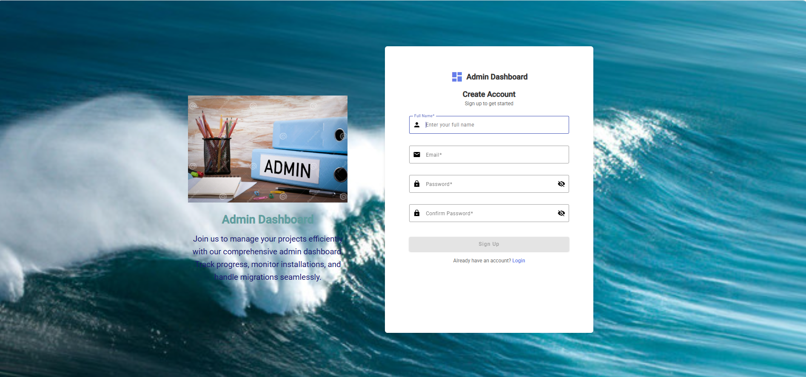
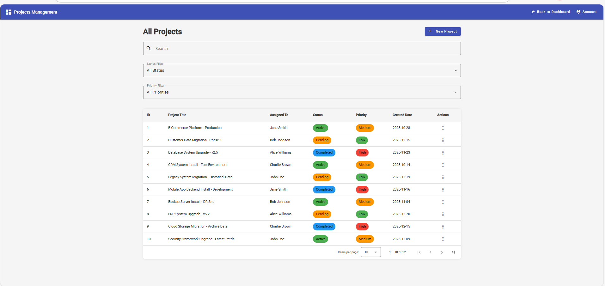

# Angular Admin Project Management Dashboard

A modern **Admin Project Management Dashboard** built using **Angular**.  
This application demonstrates authentication (login & signup), admin dashboard analytics, project management workflows, and a clean enterprise-style UI suitable for real-world admin systems.

---

## 🔗 Live Demo

👉 https://sneharudresh.github.io/angular-admin-project-management-dashboard/login

---

## ✨ Application Features

### 🔐 Authentication
- Login page
- Signup (Admin Registration) page
- Clean authentication UI flow
- Route-based navigation structure

### 📊 Admin Dashboard
- Overview cards for project status
- Active, Pending, and Completed project indicators
- Dashboard summary widgets
- Modern admin layout using Angular Material

### 📁 Project Management
- View all projects in a structured table
- Project status and priority indicators
- Action menu per project
- Clean and readable admin UI

### ➕ New Project Creation
- Dedicated Create New Project page
- Add project name, priority, and status
- Integrated into project listing
- Admin-controlled project workflow

---

## 🖼️ Screenshots

Create a folder named `screenshots/` in the project root and add images.

### Login Page

### Signup Page

### Admin Dashboard

### Projects List

### New Project Creation

---

## 🛠️ Tech Stack
- Angular
- Angular Material
- TypeScript
- HTML / SCSS
- GitHub Pages (Deployment)

---

## 🚀 Local Development Setup

git clone https://github.com/sneharudresh/angular-admin-project-management-dashboard.git
cd angular-admin-project-management-dashboard
npm install
ng serve

Open in browser:
http://localhost:4200

---

## 🌐 Deployment

ng build --configuration production  
npx angular-cli-ghpages --dir=dist/admin-dashboard-angular20-app/browser

---

## 📌 Purpose of This Project
- Showcase Angular admin dashboard skills
- Demonstrate authentication UI (login & signup)
- Build a freelancer-ready portfolio project
- Practice real-world admin panel architecture

---

## 👩‍💻 Author

Sneha Rudresh  
Frontend Developer | Angular  
GitHub: https://github.com/sneharudresh

---

⭐ If you like this project, give it a star on GitHub!
