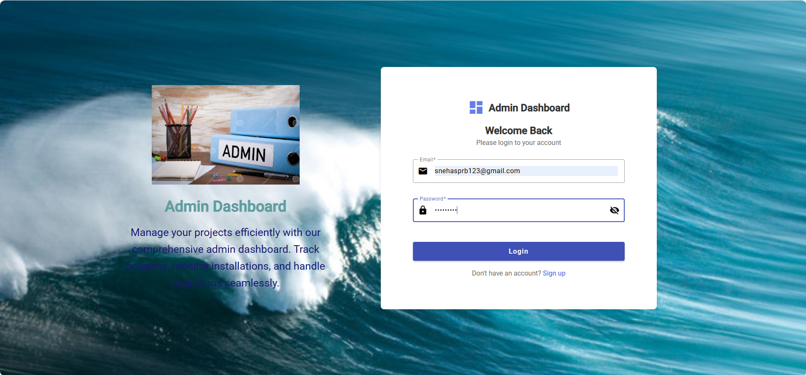
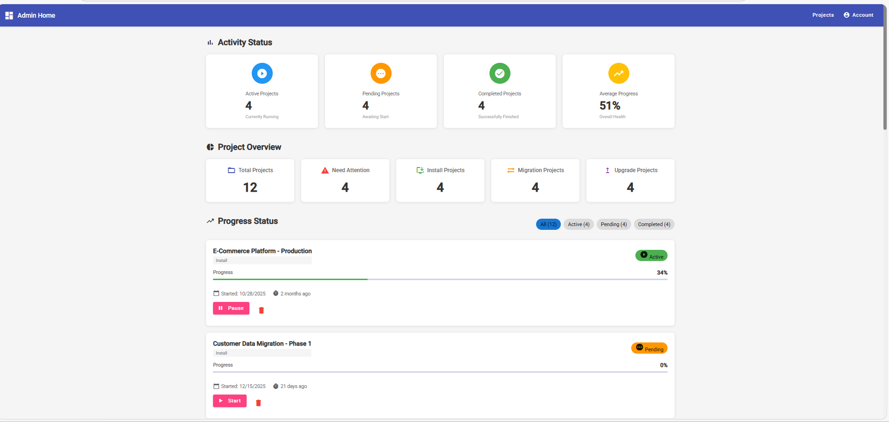
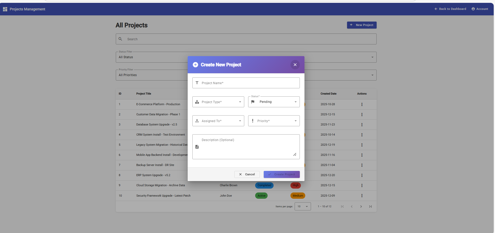

# Employee Onboarding & Admin Dashboard – Angular

A modern **Employee Onboarding Portal with Admin Dashboard** built using **Angular**.  
This application demonstrates onboarding workflows, admin project management, and clean UI design suitable for real-world enterprise systems.

---

## 🔗 Live Demo
👉 https://sneharudresh.github.io/angular-employee-onboarding-stepper-forms/

---

## ✨ Application Modules

### 🔐 Authentication
- Login page
- Admin account creation UI

### 🧾 Employee Onboarding
- Stepper-based onboarding process
- Personal Details
- Job Details
- Document Submission
- Submission success confirmation

### 📊 Admin Dashboard
- Activity status overview
- Active, Pending, and Completed projects
- Progress tracking with visual indicators
- Project summary cards

### 📁 Projects Management
- View all projects in tabular format
- Filter by status and priority
- Pagination support
- Action menu per project

### ➕ New Project Creation
- Create new projects from Admin panel
- Assign project details, priority, and status
- Integrated into project listing workflow

---

## 🖼️ Screenshots

### Login Page


### Admin Dashboard


### Projects List


### New Project Creation


### Employee Onboarding Form


### Submission Success Page


---

## 🛠️ Tech Stack
- **Angular**
- **Angular Material**
- **TypeScript**
- **HTML / SCSS**
- **GitHub Pages** (Deployment)

---

## 🚀 Local Setup

```bash
git clone https://github.com/sneharudresh/angular-employee-onboarding-stepper-forms.git
cd angular-employee-onboarding-stepper-forms
npm install
ng serve
